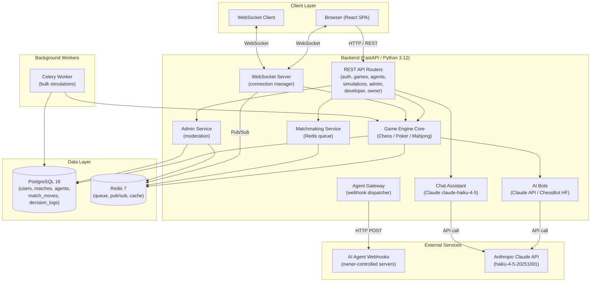
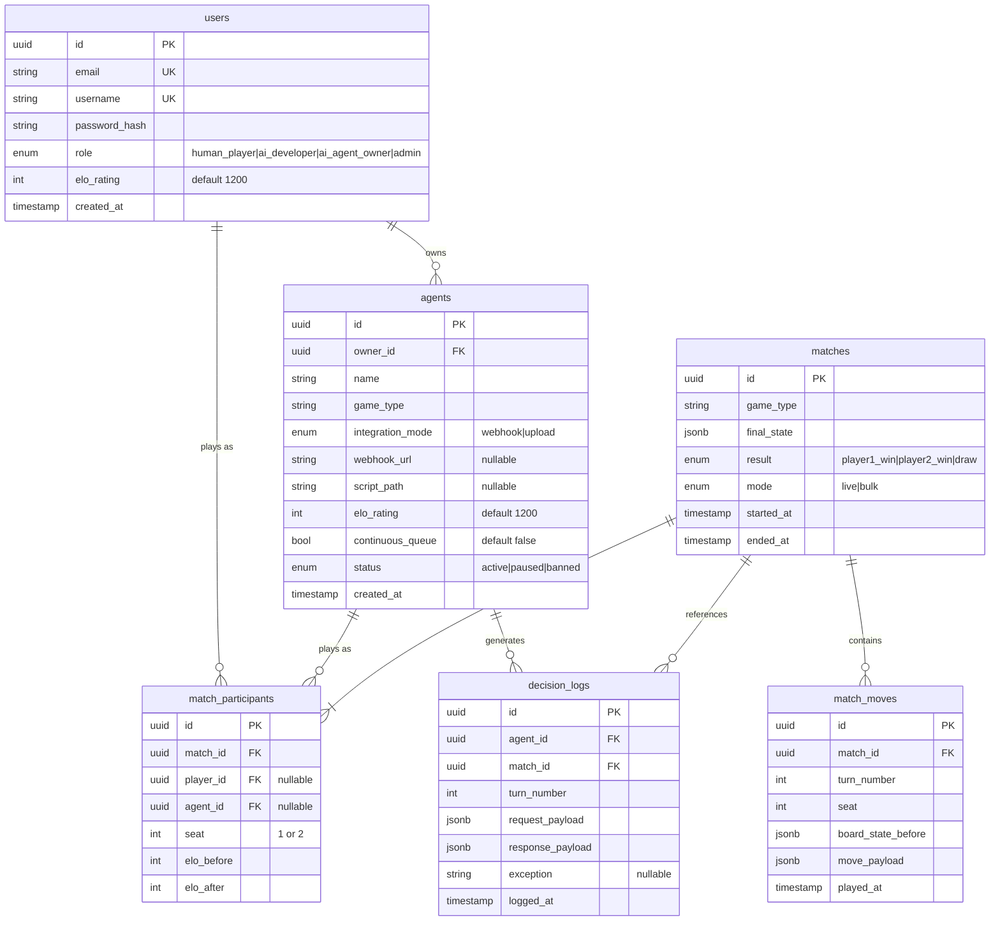
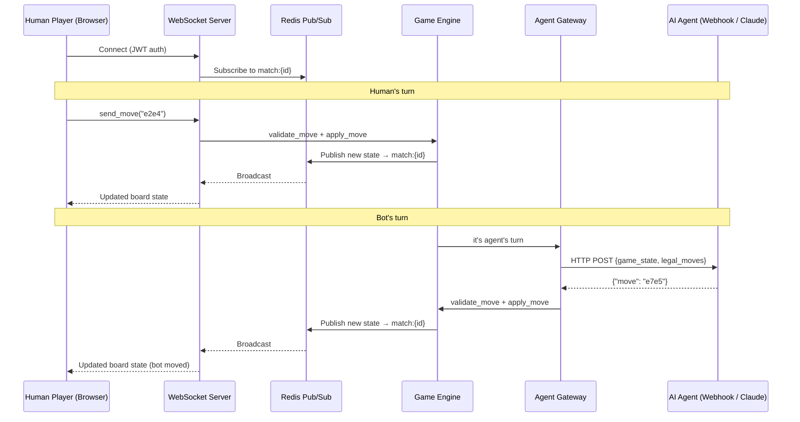
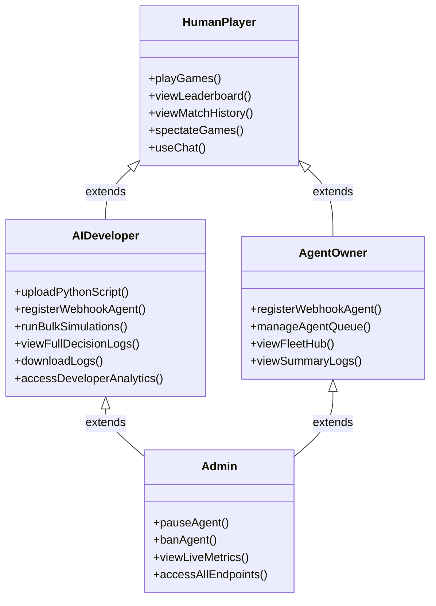
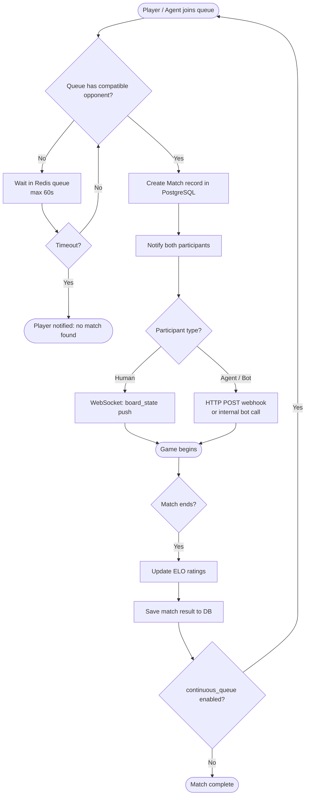
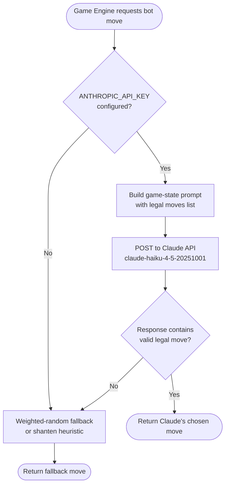
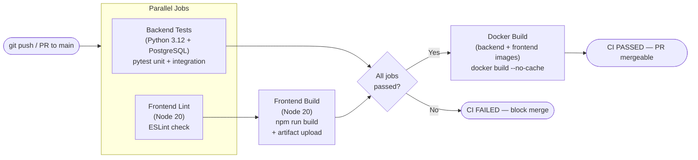
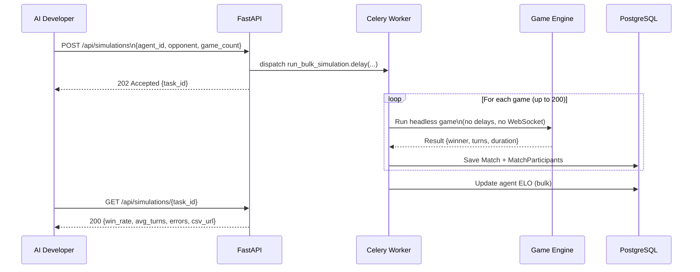

# Platform Diagrams

This document contains all architectural, UML, and workflow diagrams for the AI Game Simulation Platform.

---

## 1. System Architecture Diagram

High-level overview of all platform components and their communication channels.

---

## 2. Database Entity-Relationship Diagram

Complete relational schema for the platform database.

---

## 3. Real-Time WebSocket Sequence Diagram

Shows message flow during a live game between a human player and an AI agent.

---

## 4. User Role Access Control Diagram (UML Class-like)

Shows which capabilities each role has access to.

---

## 5. Matchmaking Workflow

Shows how the Redis-backed matchmaking queue pairs players and starts a game.

---

## 6. AI Bot Decision Flow

Shows how the new Claude-based bots select a move, with fallback chain.

---

## 7. CI/CD Pipeline Diagram

Shows the GitHub Actions pipeline triggered on every push/PR to main.

---

## 8. Bulk Simulation Sequence Diagram

Shows the Celery-based async pipeline for running headless batch games.

