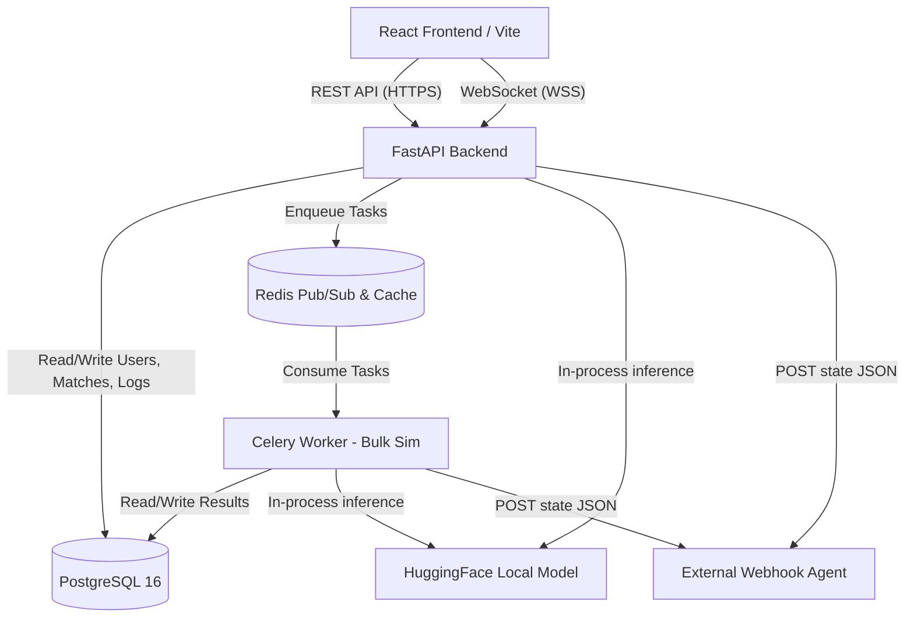
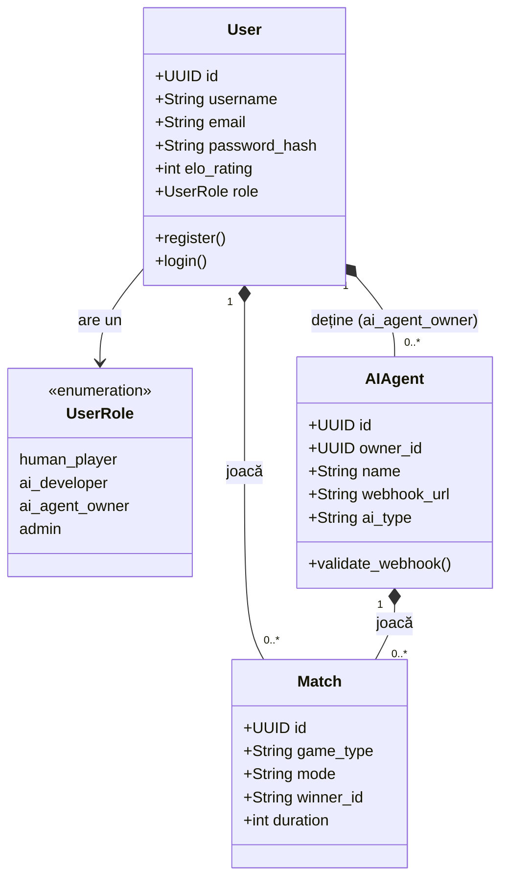
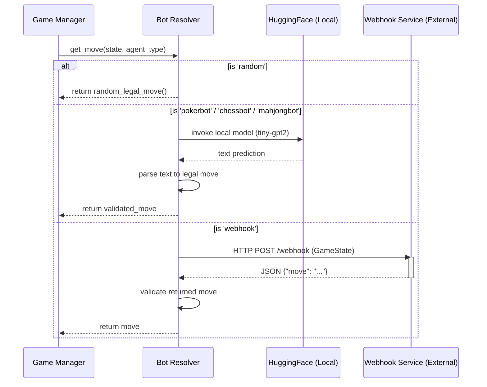

# Diagrame Tehnice (UML, Arhitectură, Workflows)

Pentru a asigura un design scalabil și pentru a îndeplini criteriul de diagrame din baremul de dezvoltare software, mai jos sunt prezentate diagramele principale ale arhitecturii sistemului, modelării claselor și fluxurilor de execuție, scrise folosind Mermaid.js.

## 1. System Architecture Diagram

Această diagramă ilustrează comunicarea dintre microserviciile care compun platforma.

## 2. UML Diagram - Role Access Control

Această diagramă ilustrează ierarhia entităților (Class Diagram) pentru modelul de baza `User` și permisiunile fiecărui `UserRole`.

## 3. Workflow Diagram - AI Decision Process

Acest workflow descrie cum decide platforma mutarea unui Agent AI în funcție de rolul acestuia (intern HuggingFace, webhook extern, random).

