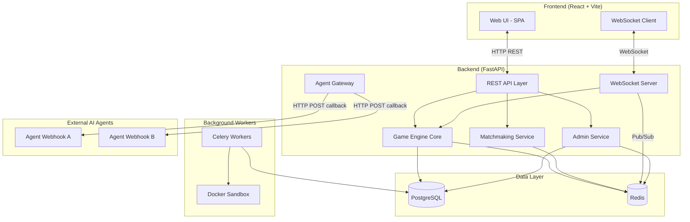
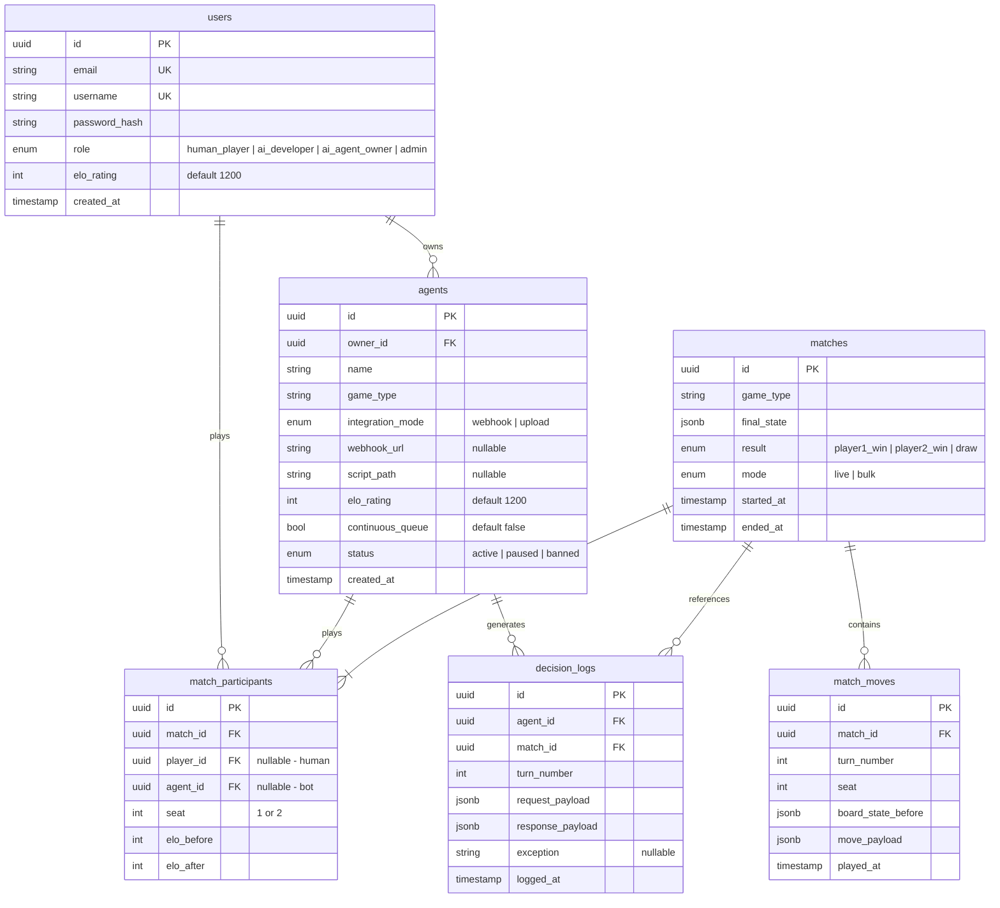
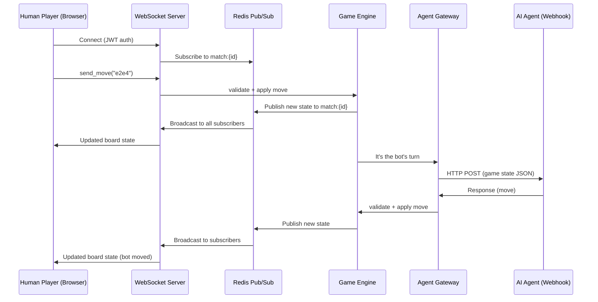

# 🎲 AI Game Simulation Platform — Architecture & Tech Stack Plan

## Goal

Design the full technical architecture for a multi-game platform (chess, poker, etc.) that treats **Human Players**, **AI Developers**, **AI Agent Owners**, and **Admins** as first-class citizens. The system must support real-time play, live spectating, AI agent webhooks, bulk headless simulations, ELO leaderboards, and administrative moderation — all from a unified codebase.

---

## Decisions Locked

| Decision | Resolution |
|---|---|
| **Deployment** | Docker Compose for portability; running locally for now |
| **First game** | Chess (deterministic, perfect information, mature `python-chess` library) |
| **Authentication** | Simple JWT + bcrypt password hashing against PostgreSQL — no OAuth |
| **Team strength** | Python-first — backend is the comfort zone; JS/React kept minimal |
| **Environment isolation** | Python `venv` inside `backend/`, `node_modules` inside `frontend/` — nothing installed globally |

---

## Proposed Tech Stack

| Layer | Technology | Rationale |
|---|---|---|
| **Backend API** | **FastAPI** (Python 3.12+) | Native async/ASGI, first-class WebSocket support, Pydantic validation for game state schemas, natural fit for Python-based AI agent execution |
| **Backend env** | **`python -m venv`** in `backend/.venv` | All pip packages stay inside the repo; no global installs; `.venv/` is gitignored |
| **Frontend** | **React 18 + Vite** | Lightweight SPA; no SSR needed (dashboard is authenticated); fast HMR; easy WebSocket integration via `useEffect` hooks |
| **Frontend env** | **npm** with local `node_modules/` | `node_modules/` stays inside `frontend/`; gitignored; reproducible via `package-lock.json` |
| **Styling** | **Vanilla CSS** with CSS custom properties | Full design control, no framework lock-in, supports dark mode and glassmorphism tokens |
| **Primary DB** | **PostgreSQL 16** | Relational integrity for users, matches, ELO history, agent registry; JSONB columns for flexible game state storage |
| **Cache / Pub-Sub** | **Redis 7** | In-memory matchmaking queue, WebSocket message broker (pub/sub channels for live spectating), session caching, rate limiting |
| **Task Queue** | **Celery** (Redis broker) | Async bulk simulation jobs (US 6), email/alert dispatch (US 11), background ELO recalculations |
| **WebSockets** | FastAPI native WebSocket + Redis Pub/Sub | Real-time board updates, spectator broadcasts, turn notifications to AI agents |
| **Containerization** | **Docker + Docker Compose** | Reproducible dev environment; isolated agent sandboxing for uploaded Python scripts; PostgreSQL + Redis run as containers |
| **API Docs** | **Swagger UI** (auto-generated by FastAPI) | Interactive docs for AI developers to test agent endpoints |

---

## System Architecture



---

## Backend Domain Decomposition

The FastAPI application is organized into five routers (domains), each mapping to a pillar or cross-cutting concern:

### 1. Auth & Users (`/api/auth`, `/api/users`)
- JWT-based registration & login (bcrypt password hashing)
- Role assignment: `human_player`, `ai_developer`, `ai_agent_owner`, `admin`
- Profile endpoints: view/edit profile, avatar, display name
- **User Stories served:** Foundation for all US

### 2. Game Engine (`/api/games`)
The most critical component. Uses a **plugin architecture** so new games can be added without modifying core logic.

```
games/
├── base.py            # Abstract GameState, GameEngine interfaces
├── chess/
│   ├── engine.py      # ChessEngine(GameEngine) — uses python-chess
│   ├── state.py       # ChessState(GameState) — Pydantic model
│   └── renderer.py    # Board → JSON for frontend
├── poker/
│   ├── engine.py      # PokerEngine(GameEngine)
│   ├── state.py       # PokerState(GameState) — handles hidden info
│   └── renderer.py
└── registry.py        # Dynamic game type lookup
```

**Key abstractions:**
- `GameEngine.validate_move(state, move) → bool`
- `GameEngine.apply_move(state, move) → new_state`
- `GameEngine.get_legal_moves(state) → list[Move]`
- `GameEngine.is_terminal(state) → Optional[Result]`
- `GameEngine.get_player_view(state, player_id) → dict` — filters hidden info (poker hands)

**User Stories served:** US 1, US 8

### 3. Agent Gateway (`/api/agents`)
Handles AI agent registration, webhook dispatch, and sandboxed execution.

**Two integration modes for AI agents:**
1. **Webhook mode** (recommended): Agent owner registers an HTTP endpoint URL. When it's the agent's turn, the platform POSTs the game state JSON to that URL and expects a move response within a configurable timeout (default 5s).
2. **Upload mode** (advanced): Developer uploads a Python script conforming to a `BaseAgent` interface. The platform runs it in a **Docker sandbox** with CPU/memory limits.

```python
# Agent interface contract (webhook payload)
{
  "game_id": "uuid",
  "game_type": "chess",
  "your_player_id": 1,
  "board_state": { ... },        # Game-specific, fully documented JSON
  "legal_moves": ["e2e4", ...],  # Pre-computed valid moves
  "turn_number": 14,
  "time_remaining_ms": 4800
}

# Expected response
{
  "move": "e2e4"
}
```

**User Stories served:** US 5, US 8, US 9

### 4. Matchmaking & Simulation (`/api/matchmaking`, `/api/simulations`)
- **Live matchmaking:** Redis-backed queue; players/agents join a pool filtered by game type and optional ELO range. When two compatible entities are found, a match is created and both are notified via WebSocket (humans) or webhook (agents).
- **Continuous queue:** Agents with `continuous_queue = true` are automatically re-inserted into the pool after each match concludes (US 10).
- **Bulk simulation:** A Celery task spins up N headless games in parallel, bypassing all artificial delays. Returns a statistical summary report as JSON/CSV (US 6).

**ELO system:**
- Standard Elo with K-factor = 32 (new players) / 16 (established)
- Computed in the application layer (not SQL) inside a PostgreSQL transaction
- `match_participants` table stores pre- and post-match ratings for full audit trail

**User Stories served:** US 3, US 6, US 10

### 5. Admin & Moderation (`/api/admin`)
- Protected by `admin` role middleware
- Live dashboard data: active WebSocket connections, CPU/memory metrics per active agent (sourced from Docker stats API or Redis counters)
- Override controls: pause agent (close its WebSocket / stop calling its webhook), ban agent (remove from registry + all queues), disconnect match
- Alert dispatch: sends email or in-app notification to the agent's owner when moderation action occurs

**User Stories served:** US 11

---

## Frontend Architecture

```
src/
├── main.jsx
├── App.jsx                  # Router setup
├── index.css                # Design system tokens, dark mode, animations
├── api/
│   ├── client.js            # Axios/fetch wrapper with JWT interceptor
│   └── websocket.js         # WebSocket manager (connect, reconnect, subscribe)
├── hooks/
│   ├── useAuth.js           # Auth context + protected routes
│   ├── useWebSocket.js      # Hook wrapping websocket.js
│   └── useGameState.js      # Derived game state from WS messages
├── pages/
│   ├── Login.jsx
│   ├── Register.jsx
│   ├── Dashboard.jsx        # Role-specific landing
│   ├── GameLobby.jsx        # Browse / create / join matches
│   ├── GameBoard.jsx        # Active game view (play + spectate)
│   ├── Leaderboard.jsx      # ELO rankings table
│   ├── MatchHistory.jsx     # Paginated past games
│   ├── AgentManager.jsx     # Upload / configure agents (developer view)
│   ├── BulkSimulation.jsx   # Trigger + view simulation reports
│   └── AdminPanel.jsx       # Moderation dashboard
├── components/
│   ├── Navbar.jsx
│   ├── ChessBoard.jsx       # Game-specific renderers
│   ├── PokerTable.jsx
│   ├── LeaderboardTable.jsx
│   ├── MatchCard.jsx
│   └── AgentStatusBadge.jsx
└── utils/
    └── elo.js               # Client-side ELO display helpers
```

### Key Frontend Flows

| Flow | Mechanism | US |
|---|---|---|
| Human plays a game | REST to join queue → WS connection for live board state → REST to submit moves | US 1 |
| Spectate AI match | REST to list live matches → WS subscribe to match channel | US 2 |
| Leaderboard | REST `GET /api/leaderboard?game=chess&type=all` | US 3 |
| Match history | REST `GET /api/users/me/matches?page=1` | US 4 |
| Upload agent | REST `POST /api/agents` (multipart form) | US 5 |
| Bulk simulation | REST `POST /api/simulations` → poll status → download report | US 6 |
| Decision logs | REST `GET /api/agents/{id}/logs?match_id=...` → download JSON | US 7 |
| Admin moderation | REST + WS for live metrics; REST `POST /api/admin/agents/{id}/ban` | US 11 |

---

## Database Schema (Core Tables)



---

## Real-Time Communication Strategy



**Spectators** simply subscribe to the same `match:{id}` Redis channel without write permissions.

---

## Monorepo Structure

```
proiectmds/
├── README.md
├── userstories.md
├── docker-compose.yml         # PostgreSQL, Redis containers (+ optional backend/frontend containers)
├── .env.example               # Template for DB URLs, secrets, etc.
├── .gitignore                 # Includes backend/.venv/, frontend/node_modules/, etc.
│
├── backend/
│   ├── .venv/                 # ⛔ gitignored — created via `python -m venv .venv`
│   ├── requirements.txt       # Pinned pip dependencies (or pyproject.toml)
│   ├── alembic/               # DB migrations
│   ├── alembic.ini
│   ├── app/
│   │   ├── __init__.py
│   │   ├── main.py            # FastAPI app factory
│   │   ├── config.py          # Pydantic Settings (reads .env)
│   │   ├── database.py        # Async SQLAlchemy engine + session
│   │   ├── models/            # SQLAlchemy ORM models
│   │   ├── schemas/           # Pydantic request/response schemas
│   │   ├── routers/           # auth, games, agents, matchmaking, admin
│   │   ├── services/          # Business logic layer
│   │   ├── games/             # Plugin-based game engines (chess/, poker/, base.py, registry.py)
│   │   ├── websocket/         # WS connection manager + Redis pub/sub
│   │   └── tasks/             # Celery task definitions
│   └── tests/
│
├── frontend/
│   ├── node_modules/          # ⛔ gitignored — created via `npm install`
│   ├── package.json
│   ├── package-lock.json      # Lockfile for reproducible installs
│   ├── vite.config.js
│   ├── index.html
│   ├── public/
│   └── src/                   # React source (see Frontend Architecture above)
│
└── sandbox/
    ├── Dockerfile             # Minimal Python image for agent execution
    └── runner.py              # Entrypoint that loads + executes uploaded agent scripts
```

> [!TIP]
> **Getting started locally** (no global installs beyond Python and Node):
> ```bash
> # Backend
> cd backend
> python -m venv .venv
> .venv\Scripts\activate        # Windows
> pip install -r requirements.txt
> uvicorn app.main:app --reload
>
> # Frontend
> cd frontend
> npm install
> npm run dev
>
> # Infrastructure
> docker compose up -d postgres redis
> ```

---

## Phased Delivery Roadmap

### Phase 1 — Foundation (Sprint 1) ✅
- [x] Project scaffolding: Docker Compose, FastAPI skeleton, React+Vite skeleton
- [x] Auth system (JWT registration/login, role middleware)
- [x] PostgreSQL schema + Alembic migrations (all 6 tables: users, agents, matches, match_participants, match_moves, decision_logs)
- [x] Basic frontend: Login, Register, Dashboard shell, Navbar
- [x] One-command startup scripts (`start.ps1` / `start.sh`)
- [x] Vite dev proxy for `/api/*` routes

### Phase 2 — Core Gameplay (Sprint 2) ✅
- [x] Game engine plugin architecture (`app/games/base.py` → abstract `GameEngine` + `GameState`)
- [x] Chess implementation using `python-chess` (`app/games/chess/engine.py`)
- [x] Game type registry with dynamic engine lookup (`app/games/registry.py`)
- [x] WebSocket connection manager (`app/websocket/manager.py`) — in-memory for now, Redis pub/sub in Phase 3
- [x] Random-move built-in AI bot (`app/games/bots/random_bot.py`)
- [x] Human vs. Random Bot — full play loop via WebSocket (US 1)
- [x] Human vs. Human — create game, share link, join, play via WebSocket
- [x] Game Lobby page — create games (vs Human / vs AI), browse & join open games
- [x] ChessBoard component — click-to-move, legal move dots, last-move highlighting, check glow, coordinate labels, board flipping
- [x] GameBoard page — player info bars, turn status indicator, move history panel, resign button
- [x] Match persistence — Match + MatchParticipant + MatchMove records saved to PostgreSQL
- [x] REST API: `POST /api/games`, `GET /api/games/open`, `GET /api/games/{id}`, `POST /api/games/{id}/join`, `POST /api/games/{id}/resign`
- [x] WebSocket API: `/api/games/ws/{id}?token=...` — send moves, receive real-time state updates

### Phase 2.5 — HuggingFace AI Integration ✅
- [x] Downloaded `Maxlegrec/ChessBot` model (~140MB) to `backend/models/chessbot/`
- [x] Patched model for `transformers` 5.x compatibility (`all_tied_weights_keys`)
- [x] Created `app/games/bots/hf_chessbot.py` — lazy-loads model, picks moves via policy head with temperature control
- [x] Bot type system: `GameSession.bot_type` routes to correct move-picker (`random` or `chessbot`)
- [x] API updated: `POST /api/games` accepts `bot_type` field (`"random"` or `"chessbot"`)
- [x] Game Lobby: 3 options — Play vs Human / Play vs Random Bot (🎲 400 ELO) / Play vs ChessBot AI (🧠 1500 ELO)
- [x] `download_model.py` script for easy model setup
- [x] `.gitignore` excludes `backend/models/` from version control

### Phase 3 — AI Integration & Social (Sprint 3) ✅
- [x] Agent registration + webhook integration (US 5, US 8, US 9)
- [X] Matchmaking queue (Redis-ready) + continuous queue toggle (US 10)
- [X] Live spectating via WebSocket (US 2)
- [x] ELO rating system + Leaderboard (US 3)
- [x] Match history page (US 4)

### Phase 4 — Advanced & Admin (Sprint 4) ✅
- [x] Bulk simulation engine via Celery (US 6)
- [x] Decision logging + download (US 7)
- [x] Admin moderation panel + live metrics (US 11)
- [x] Sandboxed Python agent upload (US 5 — upload mode frontend/API/runner done)
- [x] Polish: dark mode, animations, responsive design

---

## Verification Plan

### Automated Tests
- **Backend:** `pytest` + `pytest-asyncio` for API routes, game engine logic, ELO calculations
- **Frontend:** Vitest + React Testing Library for component rendering
- **Integration:** Docker Compose `test` profile that spins up all services and runs end-to-end WebSocket flows

### Manual Verification
- Play a full chess game through the UI against a built-in bot
- Register a webhook agent and watch it play a live match
- Spectate the match from a second browser tab
- Verify leaderboard updates after match completion
- Trigger a bulk simulation and download the report
- Admin bans an agent mid-match and verifies disconnection
